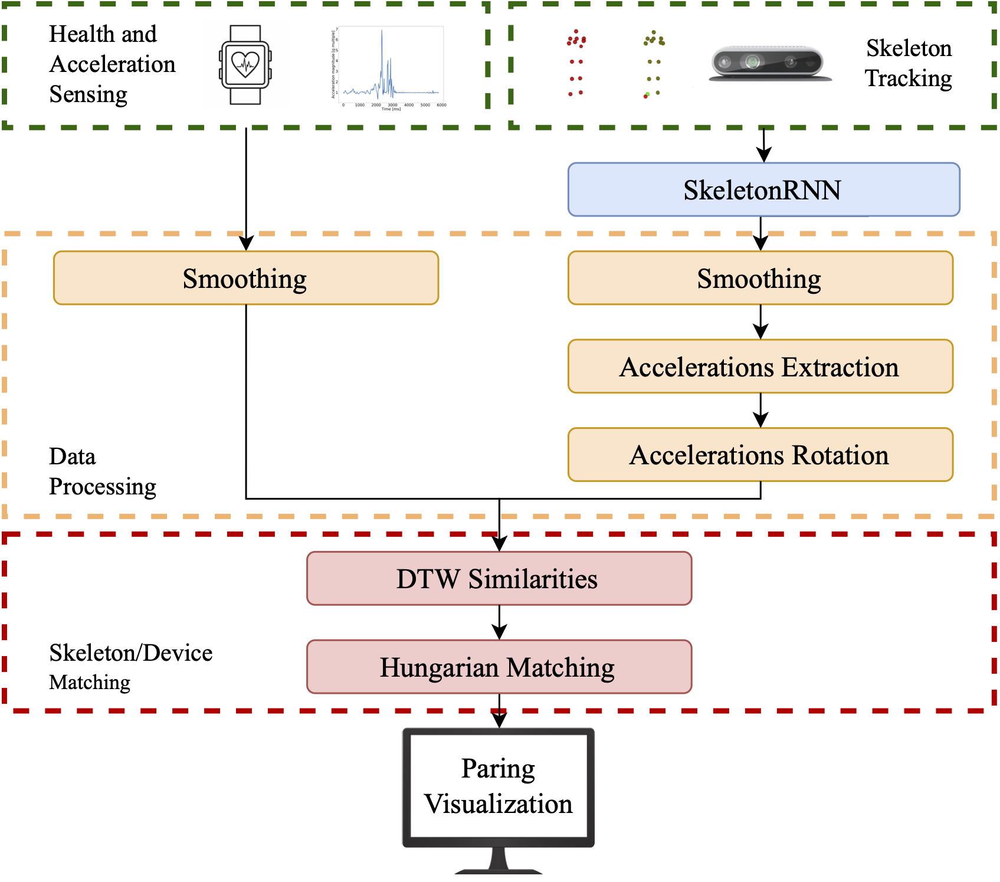
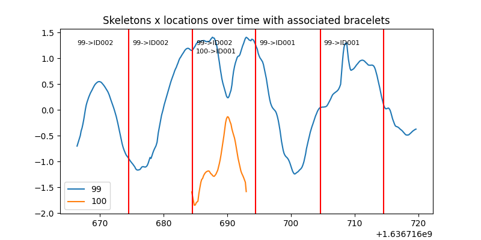

<div id="top"></div>
<!--
*** Thanks for checking out the Best-README-Template. If you have a suggestion
*** that would make this better, please fork the repo and create a pull request
*** or simply open an issue with the tag "enhancement".
*** Don't forget to give the project a star!
*** Thanks again! Now go create something AMAZING! :D
-->


[![Contributors][contributors-shield]][contributors-url]
[![Forks][forks-shield]][forks-url]
[![Stargazers][stars-shield]][stars-url]
[![Issues][issues-shield]][issues-url]
[![MIT License][license-shield]][license-url]
[![LinkedIn][linkedin-shield]][linkedin-url]


<!-- PROJECT LOGO -->
<br />
<div align="center">
<!--
  <a href="https://github.com/matteo-bastico/Multisensor-PIT">
    
  </a>-->

<h3 align="center">Multisensor-PIT</h3>

  <p align="center">
    Continuous Person Identification and Tracking in Healthcare by Integrating Accelerometer Data and 3D Skeletons
    <br />
    <a href="https://github.com/matteo-bastico/Multisensor-PIT"><strong>Explore the docs »</strong></a>
    <br />
    <br />
    <!--
    <a href="https://github.com/matteo-bastico/Multisensor-PIT">View Demo</a>
    · -->
    <a href="https://github.com/matteo-bastico/Multisensor-PIT/issues">Report Bug</a>
    ·
    <a href="https://github.com/matteo-bastico/Multisensor-PIT/issues">Request Feature</a>
  </p>
</div>

<!-- TABLE OF CONTENTS -->
<details>
  <summary>Table of Contents</summary>
  <ol>
    <li>
      <a href="#about-the-project">About The Project</a>
      <ul>
        <li><a href="#citation">Citation</a></li>
        <li><a href="#built-with">Built With</a></li>
      </ul>
    </li>
    <li>
      <a href="#getting-started">Getting Started</a>
      <ul>
        <li><a href="#prerequisites">Prerequisites</a></li>
        <li><a href="#installation">Installation</a></li>
      </ul>
    </li>
    <li><a href="#usage">Usage</a>
      <ul>
        <li><a href="#dataset">Dataset</a></li>
        <li><a href="#training">Training</a></li>
        <li><a href="#testing">Testing</a></li>
      </ul>
    </li>
    <li><a href="#roadmap">Roadmap</a></li>
    <li><a href="#contributing">Contributing</a></li>
    <li><a href="#license">License</a></li>
    <li><a href="#contact">Contact</a></li>
    <li><a href="#acknowledgments">Acknowledgments</a></li>
  </ol>
</details>

<!-- ABOUT THE PROJECT -->
## About The Project


<p align="center">
    
</p>

### Citation

Our paper is available in [IEEE Sensors](https://www.example.com) or 
```sh
  @article{
    
  }
  ```

<p align="right">(<a href="#top">back to top</a>)</p>

### Built With
Our released implementation is tested on:
* Ubuntu 20.04 / macOS 11.5
* Python 3.9.7

<p align="right">(<a href="#top">back to top</a>)</p>

<!-- GETTING STARTED -->
## Getting Started

### Prerequisites

* Create and lunch conda environment
  ```sh
  conda create -n mpit python=3.9
  conda activate mpit
  ```
### Installation
* Clone project
   ```sh
  git clone https://github.com/matteo-bastico/Multisensor-PIT.git
  cd Multisensor-PIT
  ```
* Install package for multisensor PIT
    ```sh
  pip install --upgrade --use-feature=in-tree-build .
  ```
  
<p align="right">(<a href="#top">back to top</a>)</p>


<!-- USAGE EXAMPLES -->
## Usage

### Dataset

The complete dataset for PIT can be downloaded from https://drive.upm.es/s/3zgeHKhlbWYcow1.
After downloading and extracting the file into the Data folder, you will get a data structure as follows:
```sh
  Data
  ├── skeleton_prediction	# Dataset for skeleton prediction training and testing
  │   ├── test   		# Test Dataset
  │   │   ├── examples.npy	# 259 sequences of skeletons with missing points
  │   │   └── labels.npy	# Ground-Truth
  │   └── train			# Train Dataset
  │       └── examples.npy	# 1035 sequences of complete skeletons            
  └── reidentification		# Dataset for PIT
      ├── AE_A			# All subfolders have the same structure
      │   ├── acceleration.txt	# File with bracelets data
      │   ├── skeleton.txt	# File with skeleton data
      │   └── video 		# Video as ground-truth
      ├── CR	
      ├── LE_A	
      ├── S_AE2	
      ├── case2_1		# All "case.." subfolders have the same structure
      │   ├── accel.json	# File with bracelets data
      │   ├── skeleton.json	# File with skeleton data
      │   └── video 		# Video as ground-truth
      ├── case3_2	
      ├── case5_1	
      ├── case7
      ├── AE_AE	
      ├── CR_E
      ├── SIT	
      ├── case1_1	
      ├── case2_2	
      ├── case4_1	
      ├── case5_2	
      ├── case8
      ├── AE_A_B	
      ├── DE_B	
      ├── S_AE	
      ├── case1_2	
      ├── case3_1	
      ├── case4_2	
      └── case6
  ```

Skeleton_prediction contains the training and testing data for our [SkeletonRNN](https://github.com/matteo-bastico/SkeletonRNN).
PIT data are provided, divided in case studies, in .json or .txt files. The contained data structure is the same and to open them use:

```sh
  with open("skeleton.json", "r") as fs:
      skeleton_list = json.load(fs)
  with open("accel.json", "r") as fs:
      accel_list = json.load(fs)
  ```
or 
```sh
  with open("skeleton.txt", "rb") as fs:
      skeleton_list = pickle.load(fs)
  with open("acceleration.txt", "rb") as fs:
      accel_list = pickle.load(fs)
  ```
The accelerations are stored in a list of Dicts. Each of them is structured as {'_id', 'x', 'y', 'z', 'timestamp', 'id'} where x,y and z are the accelerations in m/s^2 in the coordinates and id is the smart band identifier. 

The skeletons are stored in a list of Dicts. Each of them is structured as {'_id', 'skeletons':{'id': {'confidences', 'joints', 'joints3D'},...}, 'timestamp'} where in 'skeletons' another Dict is stored in which each key correspond to the identifier of the skeleton and the values are joints, joints3D and their confidences. The timestamp is common for all the skeletons of one frame.

### Testing

To test the Multisensor-PIT algorithm run
```sh
  python tests/test_mpit.py -s Data/reidentification/case1_1/skeleton.json -a Data/reidentification/case1_1/accel.json
  ```
The desire output (with default parameters) is the following image:

<p align="center">
    
</p>

Parameters:
* -s : Skeletons data path in the format of our dataset
* -a : Acceleration data path in the format of our dataset
* -w : Chuck size in seconds to split the entire data sequence
* -c : Camera used to record: "Intel" or "Kinect" (Default for our data is Intel)
* -asw : Acceleration smoothing window for noise removal (Default: 35)
* -asp : Acceleration smoothing poly for noise removal (Default: 1)
* -smd : Minimum duration in seconds for a skeleton to be considered valid (Default: 5, NOTE: we suggest to use at least half of the chuck size) 
* -ssf : Skeleton smoothing filter for noise removal, "savgol" or "weiner" (Default: "savgol")
* -ssw : Skeleton smoothing window for noise removal (Default: 7)
* -ssp : Skeleton smoothing poly for noise removal (Default: 1)
* -dsf : Direction smoothing filter for noise removal, "savgol" or "weiner" (Default: "savgol")
* -dsw : Direction smoothing window for noise removal (Default: 5)
* -dsp : Direction smoothing poly for noise removal (Default: 1)
* -csw : Smoothing window for conversion of skeletons positions to accelerations (Default: 3)
* -csp : Smoothing poly for conversion of skeletons positions to accelerations (Default: 1)
* -ca : Camera rotation angle on the y-axis (Default: 0)
* -sw : Weight for similarities measures balance of pure and derivative (see paper, Default: 0.7)
* -v : Verbose for console logs if >=1 (Default: 0)

### Implementation

To include our algorithm on your code 

```sh
  from mpit.algorithms import identify_and_track
  ```

Function header:

```
  identify_and_track(skeletons_frames, accelerations_dict, camera="Intel",
                       acceleration_smooth_window=35, acceleration_smooth_poly=1,
                       skeleton_min_duration=5, skeleton_smooth_filter="savgol",
                       skeleton_smooth_window=7, skeleton_smooth_poly=1,
                       direction_smooth_filter="savgol",
                       direction_smooth_window=5, direction_smooth_poly=1,
                       conversion_smooth_window=3, conversion_smooth_poly=1,
                       camera_angle=0, similarity_weight=0.7, verbose=0)
  ```


<p align="right">(<a href="#top">back to top</a>)</p>

<!-- ROADMAP -->
## Roadmap

- [ ] CUDA distributed implementation
- [ ] Skeletons graphical visualization
<!--
- [ ] Feature 2
- [ ] Feature 3
    - [ ] Nested Feature-->

See the [open issues](https://github.com/matteo-bastico/Multisensor-PIT/issues) for a full list of proposed features (and known issues).

<p align="right">(<a href="#top">back to top</a>)</p>


<!-- CONTRIBUTING -->
## Contributing

If you have a suggestion that would make this better, please fork the repo and create a pull request. You can also simply open an issue with the tag "enhancement".
Don't forget to give the project a star! Thanks again!

1. Fork the Project
2. Create your Feature Branch (`git checkout -b feature/my_feature`)
3. Commit your Changes (`git commit -m 'Add my_feature'`)
4. Push to the Branch (`git push origin feature/my_feature`)
5. Open a Pull Request

<p align="right">(<a href="#top">back to top</a>)</p>


<!-- LICENSE -->
## License

Distributed under the MIT License. See `LICENSE.txt` for more information.

<p align="right">(<a href="#top">back to top</a>)</p>


<!-- CONTACT -->
## Contact

Matteo Bastico - [@matteobastico](https://twitter.com/matteobastico) - matteo.bastico@gmail.com

Project Link: [https://github.com/matteo-bastico/Multisensor-PIT](https://github.com/matteo-bastico/Multisensor-PIT)

<p align="right">(<a href="#top">back to top</a>)</p>


<!-- ACKNOWLEDGMENTS -->
## Acknowledgments

This  work  was  supported  by  the  H2020  European  Project: Procare4Life https://procare4life.eu/  web Grant no. 875221. The authors are with the Escuela Técnica Superior de Ingenieros de
Telecomunicación, Universidad Politécnica de Madrid, 28040 Madrid, Spain (e-mail: mab@gatv.ssr.upm.es, abh@gatv.ssr.upm.es, fag@gatv.ssr.upm.es).

<p align="right">(<a href="#top">back to top</a>)</p>


<!-- MARKDOWN LINKS & IMAGES -->
<!-- https://www.markdownguide.org/basic-syntax/#reference-style-links -->
[contributors-shield]: https://img.shields.io/github/contributors/matteo-bastico/Multisensor-PIT.svg?style=for-the-badge
[contributors-url]: https://github.com/matteo-bastico/Multisensor-PIT/graphs/contributors
[forks-shield]: https://img.shields.io/github/forks/matteo-bastico/Multisensor-PIT.svg?style=for-the-badge
[forks-url]: https://github.com/matteo-bastico/Multisensor-PIT/network/members
[stars-shield]: https://img.shields.io/github/stars/matteo-bastico/Multisensor-PIT.svg?style=for-the-badge
[stars-url]: https://github.com/matteo-bastico/Multisensor-PIT/stargazers
[issues-shield]: https://img.shields.io/github/issues/matteo-bastico/Multisensor-PIT.svg?style=for-the-badge
[issues-url]: https://github.com/matteo-bastico/Multisensor-PIT/issues
[license-shield]: https://img.shields.io/github/license/matteo-bastico/Multisensor-PIT.svg?style=for-the-badge
[license-url]: https://github.com/matteo-bastico/Multisensor-PIT/blob/master/LICENSE.txt
[linkedin-shield]: https://img.shields.io/badge/-LinkedIn-black.svg?style=for-the-badge&logo=linkedin&colorB=555
[linkedin-url]: https://www.linkedin.com/in/matteo-bastico/
